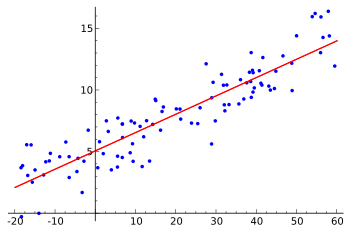

Regresion lineal

metodologia estadsitica que permite relacionar una variabkle Y dependiente, explicada en otra variable X independiente explicativa.

Y dependeinte, explicada: Si o si variable aleatoria.
X independiente, explicativa: Puede ser aleatoria o no.

En el modelo poblacional:

$\text{Recta Poblacional: } Y=\beta_0 + \beta_1 X + \epsilon $

$\text{Relación funcional: } \beta_0 + \beta_1 X$

$\text{Componente aleatoria: } \epsilon \text{ (perturbacion)}$

La distancia vertical entre el punto y la recta poblacional es la perturbacion.

$\text{Recta Muestral: } \hat{Y} = b_0 + b_1 X$

$b_0$ y $b_1$ son estimadores de $\beta_0$ y $\beta_1$ respectivamente.

Del metodo de minimos cuadrados, se obtiene que:
- $b_1 = \frac{S_{XY}}{S_{XX}}$
- $b_0 = \bar{Y} - b_1 \bar{X}$

$\bar{Y} = \sum_{i=1}^{n} \frac{Y_i}{n}$

$\bar{X} = \sum_{i=1}^{n} \frac{X_i}{n}$

$S_{XX} = \sum_{i=1}^{n} (X_i - \bar{X})^2$

$S_{YY} = \sum_{i=1}^{n} (Y_i - \bar{Y})^2 = \sum_{i=1}^{n} Y^2_i - \frac{1}{n}(\sum_{i=1}^{n} Y_i)^2$

$S_{XY} = \sum_{i=1}^{n} (X_i - \bar{X})(Y_i - \bar{Y})$

Entonces:

$S_{XY} = \sum_{i=1}^{n} X_i Y_i - \frac{1}{n}(\sum_{i=1}^{n} X_i)(\sum_{i=1}^{n} Y_i)$

## Supuestos del modelo
Condicion de homosedasticidad: La varianza de la perturbacion es constante para todos los valores de X.
1) La esperanza de cada perturbacion es cero: $E(\epsilon_i) = 0$
2) La varianza de cada perturbacion es constante: $Var(\epsilon_i) = \sigma^2$

Entonces
$E(\epsilon_i X_i) = 0$

$E(Y_i) = E(\beta_0 + \beta_1 X_i + \epsilon_i) = \beta_0 + \beta_1 X_i$

Esperanza de productos de epsilon = 0

Las perturbaciones tienen distribucion normal: $\epsilon_i \sim N(0, \sigma^2)$

## Calculo de la recta estimada

Los puntos van a generar el diagrama de dispersión.
Con los puntos se hace la recta que tiene la menor distancia vertical a todos los puntos.

El residuo es la estimacion de la perturbacion: $\hat{\epsilon_i} = e_i$

Suma de Cuadrados residuales: $SC_{res} = \sum_{i=1}^{n} e^2_i = \sum_{i=1}^{n} (Y_i - \hat{Y_i})^2$

La varianza residual: $s^2 = \frac{SC_{res}}{n-2}$

## Coeficiente de determinacion
$R^2 = \frac{S^2_{XY}}{S_{XX}S_{YY}} \quad 0 \leq R^2 \leq 1$

$R^2 \cdot 100\%$ es en que porcentace la variable X explica a la variable Y.

## La correlacion lineal 
La correlacion lineal es el grado de asociansion lienal entre las variables: En este caso ambas tienen que ser avariables aleatorias.

$r = \hat\rho$

$r = \frac{S_{XY}}{\sqrt{S_{XX}S_{YY}}} \quad -1 \leq r \leq 1$

Va a ser positiva cuando todas las observaciones en una recta de pendiente positiva, y negativa cuando todas las observaciones estan en una recta de pendiente negativa.

 Va a ser 0 cuando no hay relacion lineal entre las variables y es una nube de puntos

Interpretacion:
- Gran asociacion lineal
- Baja asociacion lineal

### Test para $\rho$
Las dos variables deben ser aleatorias

$H_0: \rho = 0 \quad H_1: \rho \neq 0$

Se elige un alfa. Se rechaza $H_0$ si:
$$ |\frac{r\sqrt{n-2}}{\sqrt{1-r^2}}| > t_{n-2, 1-\frac{\alpha}{2}} $$
T observado
$$ t = \frac{r\sqrt{n-2}}{\sqrt{1-r^2}} $$

## Test de significatividad de la regresion $\beta_1$
No se encessita que las dos variables sean aleatorias, solo la Y dependiente.

$H_0: \beta_1 = 0 \quad H_1: \beta_1 \neq 0$

Fijamos alfa pequeño, y se rechaza $H_0$ si:
$$ |\frac{b_1-0}{s/\sqrt{S_{XX}}}| > t_{n-2, 1-\frac{\alpha}{2}} $$

## Intervalo de confianza para $\mu_{Y|X=x_0}$

$$ \hat{Y_{X=x_0}} \pm t_{n-2, 1-\frac{\alpha}{2}} \cdot s \sqrt{\frac{1}{n} + \frac{(x_0 - \bar{X})^2}{S_{XX}}} $$

## Intervalo de Prediccion para $Y_{X=x_0}$

$$ \hat{Y_{X=x_0}} \pm t_{n-2, 1-\frac{\alpha}{2}} \cdot s \sqrt{1 + \frac{1}{n} + \frac{(x_0 - \bar{X})^2}{S_{XX}}} $$
 

Test de hiptesis:
A un nivel de significacion $\alpha$, (NO) existe evidencia suficiente para rechazhar $H_0$. INTERPRETACION AQUI (la demanda maxima por hora y el uso de energia al mes se relacionan linealmente)

thipotesis
regresion
iconfianza
estimadores (x raya, s cuadrado, alguna probabilidad)
