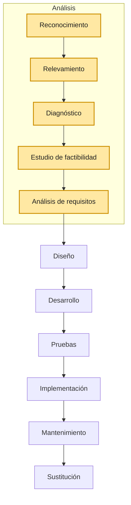

# Metodología

## 1) Reconocimiento
Primer contacto con la empresa
(¿Etapa del qué?)
Suelen ser con alguien de alto nivel: Algún gerente, director.

Usamos "Entrevista" como herramienta para recolectar información.
Se redacta un "Informe" para documentar lo que se ha recolectado en la entrevista.

## 2) Relevamiento
Estudio en detalle los procesos
(¿Etapa del cómo?)

Para recolectar la información usamos:
- Entrevistas
- Observación directa
- Cuestionarios
- Documentación existente (manuales, procedimientos, etc.)

Para documetar lo recolectado usamos:
- Organigrama
- Cursograma
- Casos de Uso
- Diagramas de flujo
- Tablas de decisión
- Diccionario de Datos
- Diagrama Entidad Relación
- Diagrama de Clase
- Informe de relevamiento

## 3) Diagnostico
Se define el problema y se plantean alternativas de solución.

No se recolecta información. Se usa el input de las anteriores etapas para definir el problema y plantear alternativas de solución.

Se documenta el diagnóstico y las alternativas de solución en un informe.

## 4) Estudio de factibilidad
Analizar opciones y ver cual es más viable.
- Técnica
- Operativa
- Económica
- Política

- Informe
- Tabla de ponderación

## 5) Analisis de requisitos
Informe de requisitos
## 6) Diseño
## 7) Desarrollo
## 8) Pruebas
## 8) Implementación
## 10) Mantenimiento
## 11) Sustitucion

## Resumen gráfico de las etapas

Ciclos de Vida
- Cascada
- Iterativo Incremental Ágil
- Prototipado
- - Evolutivo
- - Desechable
- Espiral

## Herramientas

### Para documentar
### Para recoletar información