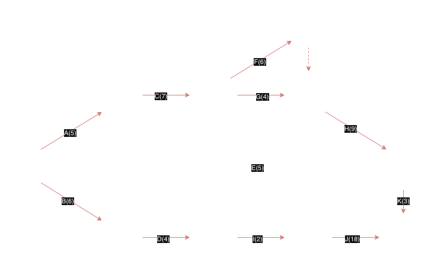

# Planeamiento

El planeamiento es una actividad que va a lo largo de toda la metodología.
No es una etapa, sino que es una actividad que se realiza en la totalidad.
Una etapa tiene un inicio y un fin, mientras que el planeamiento es una actividad que se realiza a lo largo de todo el proyecyo.

Planteo paso a paso de todas las etapas del proyecto.

Se define u conjunto de tareas que se pueden hacer en paralelo y otras dependen de la finalizacion de otra tarea (dependencia).
Las tareas tienen una duracion estimada.

Se planifican tareas y recursos. 

Triple Constraint (restriccion triple): Se planifica sobre tres ejes: Alcance, tiempo y costo. (Equipo de trabajo etc).

Todo esto lo gestiona el Project Manager, que es el encargado de planificar, organizar y controlar los recursos para alcanzar los objetivos del proyecto.

## Herramientas
### PERT o CPM
Como se coordinan las tareas de un proyecto.
hay nodos que indican las dependencias de las tareas y cada nodo tiene fechas. 

Se tienen nodos reales y ficticios.

Los nodos reales tienen las flechas que van a unicamente a un nodo, mientras que los nodos ficticios tienen flechas que van a varios nodos. 

Las tareas ficticias no conllevan tiempo ni recursos (se grafican con líneas discontinuas), sino que se utilizan para representar dependencias entre tareas.

Las tareas reales tienen una duración estimada y requieren tiempo, pero no necesariamente recursos.

Tareas que preceden y anteriores.

Se necesita saber el tiempo de las tareas.

Fecha temprana: fecha mas temprana en la que se puede iniciar una tarea, considerando las tareas anteriores.
Fecha tardia: fecha mas tardia en la que se puede iniciar una tarea sin retrasar el proyecto.

-Dependencia de tareas es necesario.

LA TAREA ES LA FLECHA. La tarea se representa entre dos nodos.
La tarea puede llamarse por su nombre o por los extremos de los nodos. 

El nodo es un punto de inicio o fin de una tarea. Es un sistema de grafos.
El nodo conecta tareas, y las tareas conectan nodos.

Dos tareas no pueden relacionar dos nodos

Las tareas ficticias sirven para respetar las reglas de grafo PERT.

Dos tareas no pueden relacionar los mismos dos nodos

Fecha temprana: primera oportunidad de fecha en iniciar a hacerse (camino mas largo entre nodos)
Fecha tardia: Es el mas chico que se obtiene de restar la tardia del siguiente nodo menos la duracion de la tarea.

PERT es probabilistico y CPM es deterministico.

#### Margen total
Son de las tareas

$$ Margen Total = F_{Tardia_j} - F_{Temprana_i} - Duracion_{ij} $$

i es un nodo que precede a j

i es el nodo inicial y j es el nodo final de la tarea.

Si el $MT = 0$ entonces la tarea es critica, es decir, no tiene margen de tiempo y cualquier retraso en esta tarea retrasará el proyecto.

El camino critico es el camino a traves de 

Si tarea es critica, entonces la Fecha Temprana es igual a la Fecha Tardia.

### Ejemplo

| Tarea | Duracion | Precedencia |
|------|----------|-------------|
| A    | 5        | -          |
| B    | 6        | -           |
|C|7|A|
|D|4|B|
|E|5|A,B|
|F|6|C|
|G|4|C,A|
|H|9|F,G|
|I|2|D|
|J|18|I,E|
|K|3|H,E|

Entonces las actividades criticas son A, C, F, G, H, D, I, J, K
Los caminos criticos son A-C-F-H-K y A-C-G-H-K  y B-D-I-J

### Diagrama de Gantt
Es el PERT pero e n una tabla. Se ve la superposicion de tareas.

Sirve para ver superposicion de tareas mientras que el PERT sirve para ver las dependencias entre tareas.