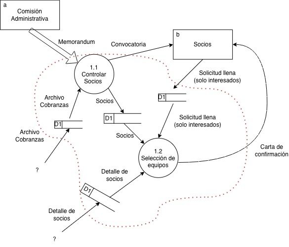

# Clase 2

DFD NIvel 0: Diagrama de contexto
DFD Nivel 1: Diagrama de flujo de datos

La tabla de eventos del DFD-0 va a indicar cuantos procesos hay en el DFD-1.

La demora es no volátil. Es decir, no puede ir en memoria RAM. Tiene que ser una DB, disco duro, en formato papel. 

Una infromacion va a estar demorada hasta que se inicie el proceso.

Un proceso externo, tendra todas sus entradas demoradas excepto el flujo activador.

El flujo activador siempre es de una entidad externa.

Las salidas a entidades externas nunca van a estar demoradas. Siempre van a ser inmediatas.

Internamente, la informacion entre procesos siempre estara demorada hasta que este el flujoa activador.

Los procesos temporales se marcan con una T.

Pregunta/respuesta (aprobación externa): no va demorada.

El contexto del sistema se encierra en lineas punteadas, Las demoras quedan dentro. Las entidades externas quedan fuera.

