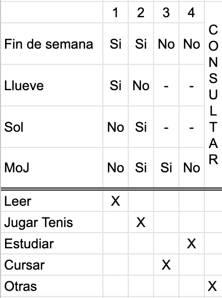
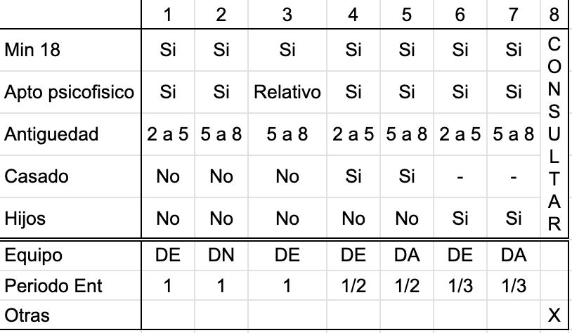
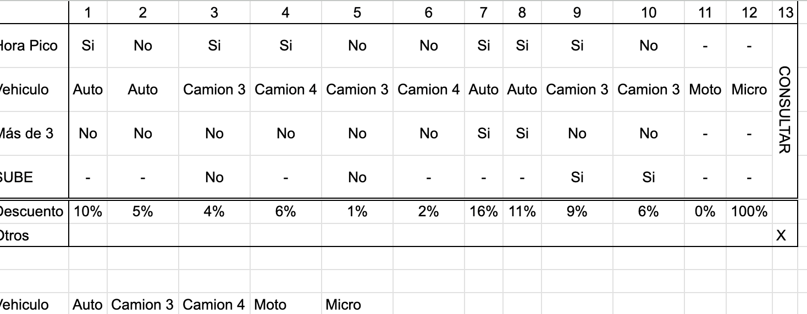

# Definicion de procesos 

DFD: Relaciones de entradas y salidas entre nuestro sistema y las entidades externas.
Definicion de procesos: permite ver que hace cada proceso y como se relaciona con los demás procesos del sistema.

La definicion se puede hacer en pseudocodigo o tablas de decision.

En pseudocodigo no lo vamos a hacer. Pero usamos "mientras, si, sino, etc". No usar estructuras atadas a un lenguaje (switch, while, do, if).

## Tabla de decision
La tabla de decision permite documentar las condiciones y acciones que yo tenga que tomar.

Decision programada: Si ocurre una condicion, entonces se ejecuta una accion. Ej: Si es sabado, salgo a correr, independiemtente del clima. 

Decision no programada: Si ocurre una variable no controlable, entonces se ejecuta una accion. 

Pseudocodgio:

- Si `es fin de semana` y `llueve`  => `leo`
- Si `es fin de semana` y `hay sol` => `juego tenis`
- Si es dia de semana MoJ    => Curso
- Si es dia de semana no MoJ => estudio

Condiciones: Fin de semana, llueve, sol, dia de semana, MoJ

Acciones: Leer, jugar Tenis, Estudiar, Cursar

Forma Binaria: las condiciones estan dadas por si o por no

Ponemos arriba las condiciones y debajo las acciones, separados con una doble linea.

Si la condicion no interesa, va un "-".

En la forma extendida, podemos poner asi, para acortar:
Para Dia de semana, se pueden agrupar. Entonces: diaDeSemana: [MoJ, LMV, SD]

Clima: [Lluvia o sol]

136) Club

Si hay dos reglas con mismas condiciones y diferentes acciones, existe una contradicción. Se sacan de la tabla, y hay que ir a consultar al cliente que pasa en ese caso.

Reglas redundantes: distintas reglas pero misma acción

46) Peaje - 2013

Se puede separar el adicional en otro caso. Da igual.