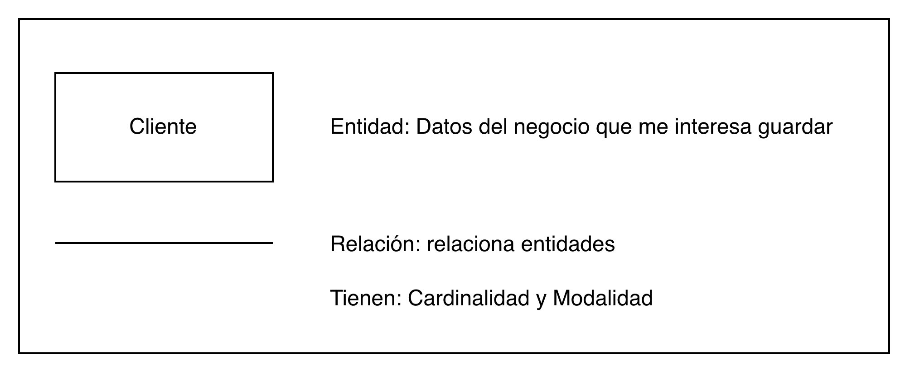
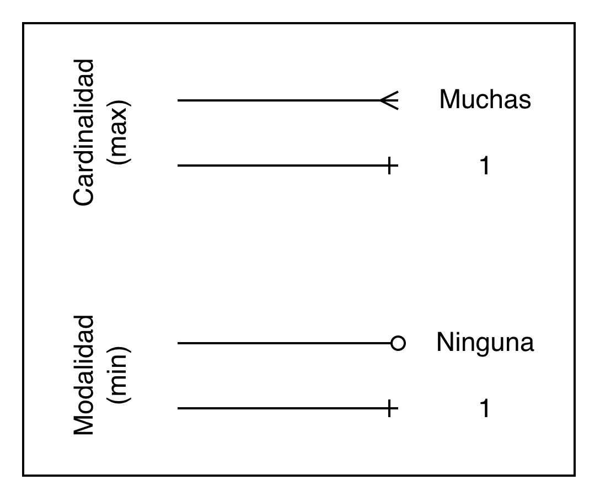
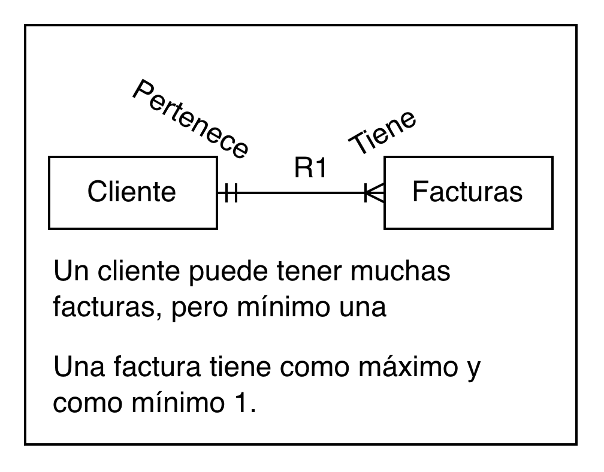
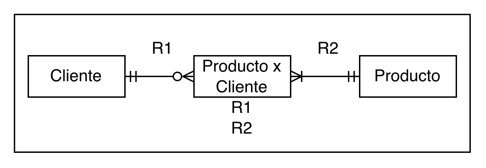
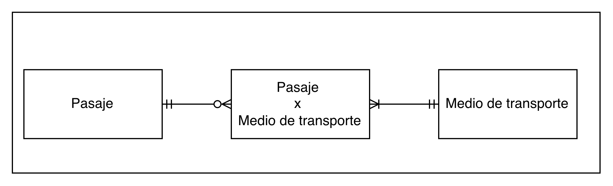
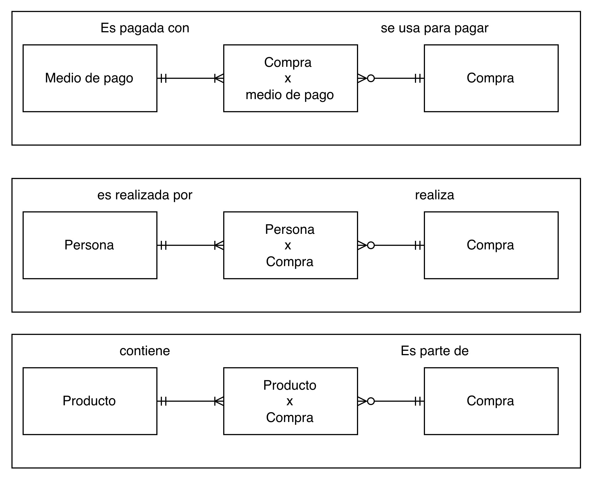

## DER (Diagrama Entidad Relación)

Cada entidad tiene atributos. Son los datos de la entidad.

Por ejemplo para Cliente:
- <ins>Tipo Documento</ins>
- <ins>Documento Cliente</ins>
- Nombre Cliente
- Dirección
- Teléfono

Tiene que tener atributos Claves (PK).
Puede ser el conjunto de atributos (compuesta), o solo uno.
Se subraya el atributo clave.

El documento, por ejemplo, puede ser DNI, libreta civica, pasaporte. Entonces para garantizar la unicidad, agregamos tipo de documento, para que no haya dos clientes con el mismo documento.

Las claves naturales son las que ya existen en el mundo real.

Por ejemplo, para la factura:
- <ins>Nro. Factura</ins>
- CAE
- CUIL
- Fecha
- Items
- Cantidad
- Monto
- R1 (equivale a la clave de la relación)

La clave de la entidad cliente viaja a la entidad factura. Pues la factura tiene un unico cliente, y el cliente tiene muchas facturas.

En la factura, se enumera la relación como item, haciendo referencia a la clave que viaja.

Relaciones:
- Uno a uno
- Uno a muchos
- Muchos a muchos: hay que romper la relación para permitir la existencia de la relación.

195). 

A) 
- Un pasaje es de exactamente un cliente.
- Un cliente puede comprar minimo uno o muchos pasajes. (rayita y flechita)

- Un pasaje es vendido por exactamente una empresa
- Una empresa vende minimo uno o muchos pasajes.

- Un pasaje tiene como destino exactamente una ciudad
- Una ciudad puede tener ningun o muchos pasajes (a debatir con el profe la cardinalidad.)

- Un pasaje tiene uno o muchos medios de transporte
- Un medio de transporte tiene cero o muchos pasajes.
  
Cliente - Pasaje: Uno a muchos
Pasaje - Empresa: Uno a muchos
Pasaje - Ciudad: Uno a muchos
Pasaje - Medio de transporte: Muchos a muchos

B) 

- Una compra tiene uno o varios medios de pago
- Un medio de pago puede tener cero o muchas compras.

- Una una persona puede tener cero o muchas compras
- Una compra tiene una o muchas personas

- Una compra puede tener uno o muchos productos
- Un prodcuto puede tener cero o muchas compras asociadas.

