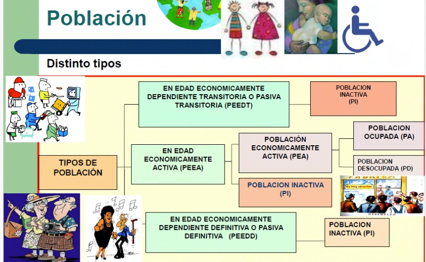
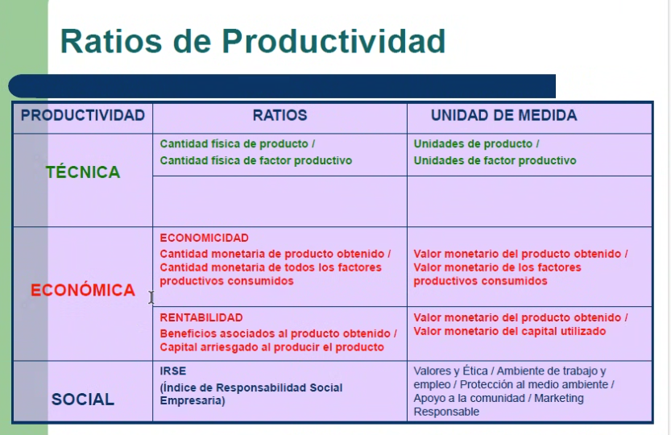
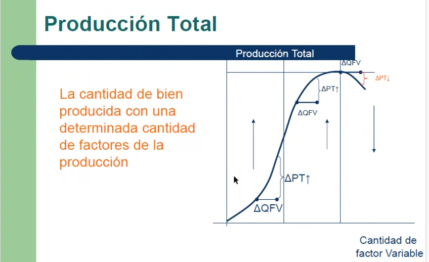
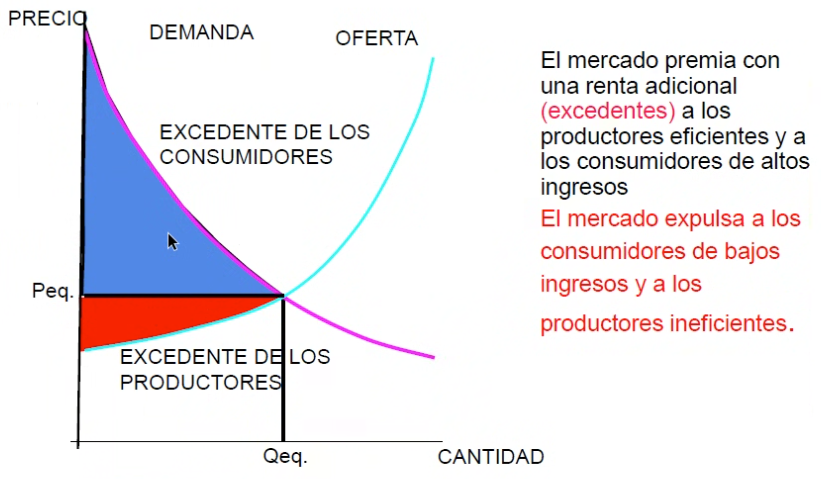

# Clase 18/8/2026

El bloque 1 es de Demanda. La otra parte es de Oferta.

Sobre el TP:

una carpeta por grupo
En el excel, solo queremos editar las celdas en blanco

Producto de nicho específico idealmente.

¿Por qué este producto va a ser distinto?

Tiene que haber información de mercado para llenar los excels.

Tiene que tener costos variados (no vale kiosco, importación).

## Clase pasada
- Tipos de bienes
- Ciencia que estudia la escases
- Demanda
- Ley de utilidad marginal
- Elasticidad
  - Elasticidad precio de la demanda: Cant consumida ante cambio en precio (poder de mercado de empresa y consumidores)
  - Elasticidad ingreso de la demanda: Cantidad consumida ante cambio en ingreso (bienes normales y bienes inferiores)
  - Elasticidad cruzada de la demanda / bienes complementarios: Cantidad consumida ante cambio en precio de otro bien (bienes sustitutos y bienes complementarios)
- Ejemplos de producto
- Variables endógenas y exógenas
- Asimetrías de información
- Curva de demanda (se suponen constantes las demás variables)
  - Renta
  - Gustos
  - Preferencias
  - Precios bienes sustituos

# Teoría de la producción

## El desafío de la sociedad
- ¿Qué producir?
- ¿Cómo producir?
- ¿Para quién producir?
- ¿Cómo racionar los productos en el tiempo?
- ¿Cómo lograr el mantenimiento y crecimiento del sistema?

## Factores productivos
Las familias son dueñas de los factores productivos y los alquilan a las empresas. Los factores productivos son:
| Factor | Definición | Retribución |
|--------|------------|-------------|
| Tierra | Recursos naturales, materia prima sin alteración humana | Renta |
| Trabajo | Esfuerzo humano | Salario |
| Capital | Bienes producidos por el hombre que se usan para producir otros bienes/dinero | Interés |
| Empresa | Organiza los factores productivos | Beneficio |

### Población
#### Población económicamente activa y no activa

- PEEA: Población en edad económicamente activa
  - PI: No tiene interés en trabajar
  - PEA: Población económicamente activa
    - PD: Tiene interés en trabajar, pero está desempleado
    - PA: Población con trabajo
- PEEDT: Niños, discapacitados, etc.
- PEEDD: Jubilados, pensionados, etc.

#### Distribuciones de la población
pirámide poblacional: distribución de la población por edad y sexo.
Problemas de la jubilación a largo plazo.

### Capital
- Capital fijo: Bienes que se usan para producir otros bienes y duran más de un año (maquinaria, edificios, etc.). Se deprecia con el uso (depreciación y amortización contable).
- Capital circulante: Dinero

### La Empresa
La unidad de producción
Toma los factores productovos y los combina para producir bienes y servicios. La empresa es la unidad de producción.

## Función productiva
Relaciona *producción obtenida de un bien determinado* con *la cantidad de factores productivos utilizados*.

## Modelo económico de producción (corto plazo)
Decimos que se trabaja en el corto plazo si al menos un factor de producción es fijo y otro es variable.
Por ejemplo, consideramos fijo el capital y variable el trabajo.

### Productividad
> Utilidad marginal: cuánto me aporta de utilidad la última unidad consumida

Producción media: relación entre la cantidad producida y la cantidad de trabajadores

Producción marginal: si aumento un trabajador, cuánto va a crecer mi producción.

La productividad técnica es útil para comparar plantas de producción, independientemente del precio. Un producto más caro puede aparentar mayor rendimiento económico, pero eso no refleja la productividad técnica.

#### Función de producción total
Su derivada es la función de producción marginal. La función de producción total es creciente, pero a un ritmo decreciente, porque el factor fijo limita la producción.

#### Ley de rendimientos decrecientes
La ley de rendimientos decrecientes establece que, al aumentar un factor productivo manteniendo los demás constantes, la producción total aumenta a un ritmo decreciente. Esto ocurre porque el factor fijo impone una restricción.

Por ejemplo, con una sola máquina y más empleados, al principio la producción aumenta, pero llega un punto en que la máquina no da abasto y la producción deja de aumentar o incluso puede disminuir.

### Función de oferta
$$Q_a = O(P_a, P_b, r, z, E)$$

Constantes:
- Precios de factores productivos (r)
- Tecnología (z)
- Cambios en expectativas (E)
- Precios de bienes relacionados (P_b)

#### Desplazamiento de la curva de oferta
- Caída/suba de precios de insumos
- Mejoras/empeoramiento tecnológico
- Cambios en expectativas
- Precio de bienes relacionados
- Clima
- Guerra

### Elasticidad de precio de la oferta
Cuanto cambia la cantidad ofrecida de acuerdo al precio de mercado.

> [!TIP] Pregunta de parcial
>¿Cuales son los factores que mueven la oferta y la demanda?
> Si cambian los gustos, que se ve afectado? (la demanda.)

## Oferta y demanda
La superposición de ambas curvas permiten encontrar el punto de equilbro de mercado.
Se dice que el mercado se vacía, pues se pueden alojar todos los bienes en todos los consumidores.

Si el precio aumenta, la demanda se reduce entonces sobra el stock.
Si el precio baja, las firmas no están interesadas en producir en ese precio, y el producto no tiene stock.

### Excedente
Debajo de la curva de demanda, se ubica el excedente del consumidor.
Sobre la curva de la oferta se ubica el excedente del productor.

Como el precio es único, los consumidores pueden ganar o resultarles más conveniente de lo que esperaban.

### Tipos de mercado
| Mercado | Cantidad de productores | Cantidad de consumidores | Tipo de producto | Información | Barreras| Precio |
| ------- | -----------| ---------- | ----------| --------| ----| --- | 
| Competencia perfecta| Infinitos | Infinitos | Homogéneo | Transparente | Nulas| Fijado por le mercado|
| Monopolio | Único | - | Único | Única | Imposible entrar | Fijado por el productor |
| Oligopolio | Pocas | - | HOmogéneo | Poca | Muy alta | Se organizan entre ellas para tener precios similares|
| Competencia monopólica | Tiene sustitos cercanos, pero practicamente son mono´policos

Competencia perfeta: El prodcutor es precio aceptante. Puede modificar su producción, pues vender más o menos no tiene impacto en el mercado
Monopolio: Define el precio. Modificar su producción implica varíar la dispnibilidad del mercado entero

Causas de la imperfección de mercados: 
- Economias de Escala y bajos costos
- Barreras de entrada y salida del mercado
- Monopolios naturales
- Patentes
- Marcas