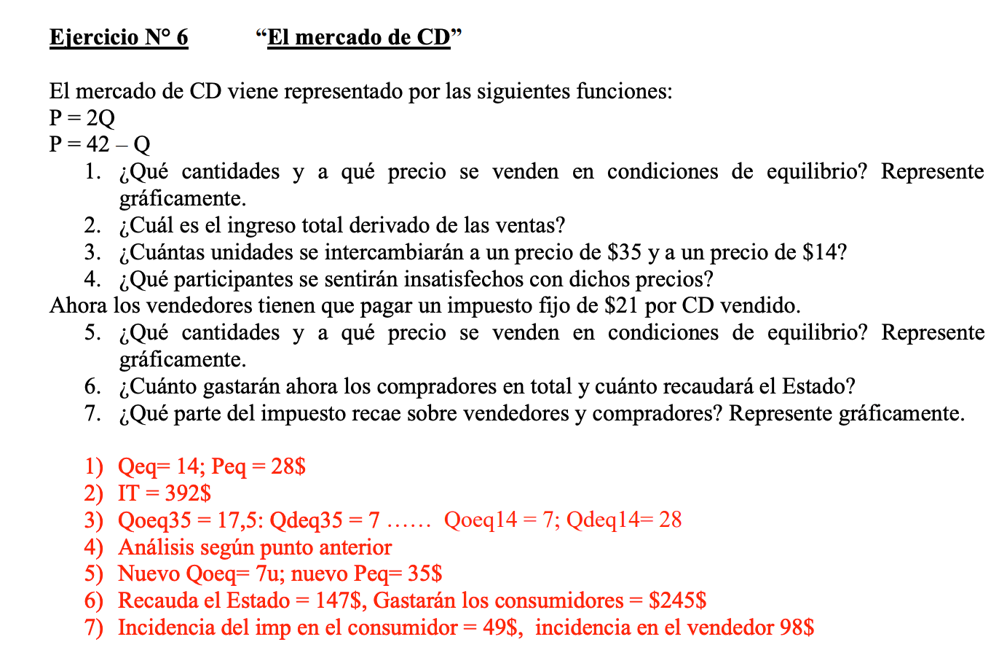
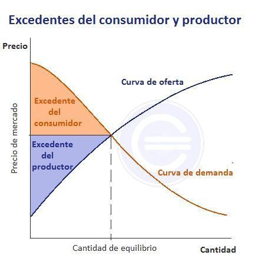
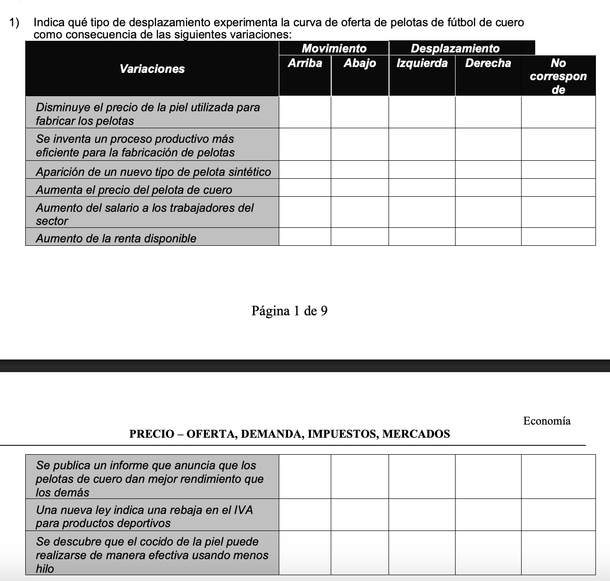
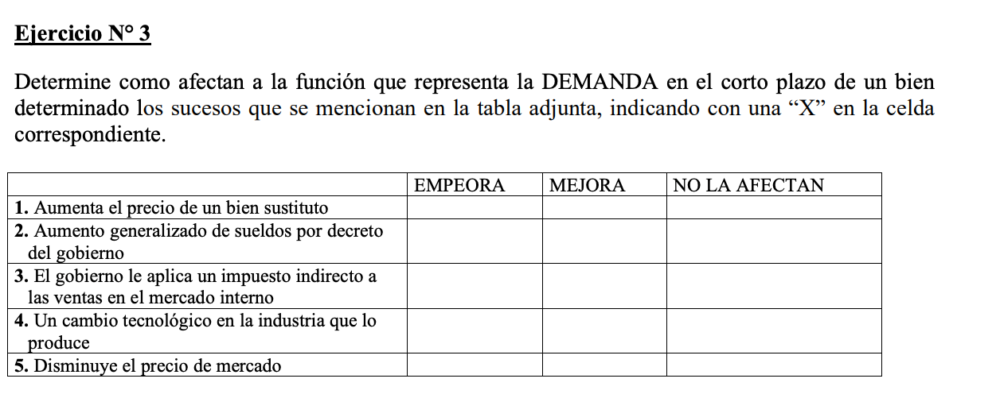
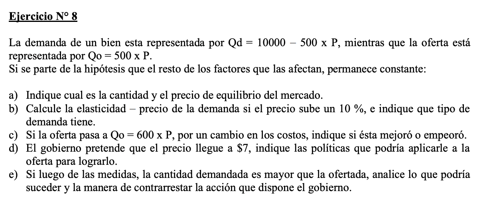

Variamos las cantidades en funcion del precio.

El precio es una estrategia de potestad de quien oferta.

La cantidad son resolucion de conductas que validan ese precio o no.

El fabricante es quien decide el precio.

La red social es una herramienta de comunicacion. Para el marketing industrial no aplica como herramienta de venta.

1) 
$$ O = D $$
$$ 2Q = 42-Q $$
$$ Q = 14 $$
$$ p = 28 $$

Entonces el precio de equilibrio es 28 y la cantidad de equilibrio es 14.

- Excedente del consumidor: debajo de D y arriba del precio de equilibrio.
- Excedente del productor: arriba de O y abajo del precio de equilibrio.

2) $$ IT = p \times Q = 28 \times 14 = 392 $$
3)
Precio minimo sosten.

Que pasaria que se ponga en 35, habria mayor oferta que demanda.
Es la interseccion del precio con la curva de Demanda.

$$ Q_d = 42 - 35 = 7 $$

Que haya mayor cantidad de personas que pueda acceder ese bien, eso seria poner un precio maximo de interevencion estatal.

En este caso, sucede que va a haber exceso de oferta, entonces va a haber desabastesimiento.

Intervencion estatal: 
- medida directa (precio minimo/sosten, precio maximo) No modifica la curva
- medida funcional (impuesto, subsidio) desplazan la curva, variable exógena.
- medida indirecta (campaña social, concientizacion, o de algun provado etc) no modifica la curva, pero puede modificar la demanda.

4)
Como el impuesto es sobre UNIDAD VENDIDA, se modifica la funcion de oferta.

Internamente, el impuesto aumenta el costo de producción para el productor, lo que desplaza la curva de oferta hacia la izquierda.

$$ P_O = 2Q + 21 $$
$$ P_D = 42 - Q $$
$$ 2Q + 21 = 42 - Q $$
$$ 3Q = 21 $$
$$ Q = 7 $$
$$ P = 2(7) + 21 = 35 $$
El nuevo punto de equilibrio es (7, 35). El impuesto genera un aumento en el precio y una disminución en la cantidad de equilibrio.

Si es un subsidio, el efecto es inverso. La curva de oferta se desplaza hacia la derecha, aumentando la cantidad de equilibrio y disminuyendo el precio de equilibrio, pues implica un menor costo de producción para el productor. Se busca que haya mayor oferta.

Erogacion del estado (subsidio) o una recaudacion (impuesto)

6) Recaudación del Estado: 
$$ imp \times Q_v = 21 \times 7 = 147 $$

Incidencia del impuesto:
- Consumidor:  $(P_{nuevo} - P_{viejo}) \times Q = (35 - 28) \times 7 = 49$
- Productor: $14 \times 7u = 98$

$$\text{Elasticidad de precio de la demanda} = - \frac{\Delta Q}{\Delta P} \times \frac{P}{Q} = -(-1) \times \frac{28}{14} = 2$$

$$\text{Elasticidad de precio de la oferta} = \frac{\Delta Q}{\Delta P} \times \frac{P}{Q} = 0.5 \times \frac{28}{14} = 1$$

Cuando se efrentan O y D y tienen distinta elasticidad, el que tiene menor elasticidad es quien absorbe mas el impuesto. 
En un producto perfectamente inelastico, el impuesto lo absorbe el consumidor, y en un producto perfectamente elastico, el impuesto lo absorbe el productor.

## Ejercico 2

Variables endogenas: P y Q. Es una decision de la empresa variar el precio.

Costo productivo: es una variable exogena. Producen desplazamiento.

1) Derecha
2) Derecha
3) No aplica
4) Movimiento hacia arriba
5) Izquierda
6) No aplica
7) No aplica
8) No aplica
9) Derecha

$$ Y_d = C + S $$
$$ Y_d = Y - Td + Tr $$

## Ejercico 3

1) Mejora
2) Mejora
3) No afectan
4) No afectan
5) Mejora

- Elasticidad normal: Bienes inferiores y normales
- Elasticidad cruzada: Sustitos y Complementarios

## Ejercicio 8

$$ 10.000 - 500 P = 500P $$
$$ P = 10 $$

a) la canitdad de equilibrio es 5.000 unidades y el precio de equilibrio es 10.
b) 

Si el precio aumenta en un 10%, el $P_{nuevo} = 11$
El $$ \Delta Q$$ es 500
El $$ \Delta P$$ es 1

epd = 1

La demanda es unitaria.

c) Mejoró

d) Politica funcional (subsidio). 

e) Desabastecimiento. Un subsidio a la oferta

## TEORIA

Integracion horizontal: me especializo en un alinea de productos

Integracion hacia atras: me integro a la cadena de valor, por ejemplo, compro la materia prima.

Integracion hacia adelante: me integro a la cadena de valor, por ejemplo, compro la distribucion.

Integracion vertical: me integro a la cadena de valor, por ejemplo, compro la distribucion y la materia prima.