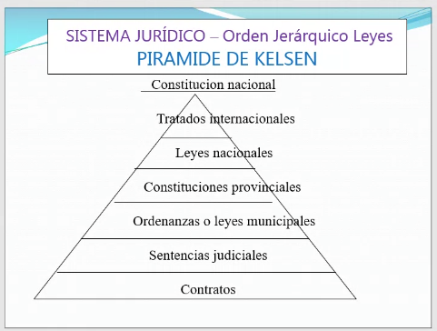

# 
> [!NOTE] Norma
> Algo que nos ponemos de acuerdo como socidad.
> Estan telacionadas con la cultura local.
>
>"Regla de conducta que uno tiene que cumplir"

En caso de no cumplirla, se puede recibir una sanción. 

## Nombre
El nombre es un atributo unico de la persona.
En el año 68 se produce una ley del nombre. Esta ley establece que la mujer puede decidir adoptar el apellido de su esposo o mantener el suyo propio.

## Tipos de Normas
- Normas Religiosas
- Normas Sociales (saludar, vestimenta en una entrevista de trabajo, etc.)
- Normas Morales (ceder el asiento del coletivo)
- **Normas Jurídicas** (leyes, reglamentos, etc.)

> [!TIP] Diferencia
> Las normas juridicas traen consecuencias. El Estado tiene la facultad de sancionar a quien no cumpla con la norma.
> Las otras normas, no tienen sanción por parte del Estado.

## Características de las normas jurídicas

- Regulan las relaciones entre las personas
- Exterioridad: No toma en consideración la intención de la persona, sino el acto en sí.
- Imperatividad: Obliga a cumplirla, no es opcional.
- Generalidad: Son para todas las personas, de la misma forma para todos.
- Coercibilidad: Amenaza en caso de incumplimiento. 
- Coactividad: Aplicación de la fuerza por parte del Estado para hacer cumplir la norma.

### Leyes
Las leyes son normas juridicas escritas. 
Si no esta escrito, está permitido.

La ley esta hecha por una autoridad competente: El poder legislativo.
Este poder puede agregar o derogar leyes.

Excepcionalmente, el Ejecutivo puede legislar (DNU, etc.).

## El Derecho
- El derecho es el orden social justo.
- El derecho son conductas en interferencia antisubjetiva.

### Derecho objetivo y derecho subjetivo
- Derecho objetivo (positivo): Conjunto de normas juridicas que regulan la conducta de las personas.
- Derecho subjetivo (natural): Relaciones jurídicas que surgen de la aplicación del derecho objetivo.

### Ramas del derecho
- Derecho público: Tiene como objeto el interés público y el Estado es quien vela por su cumplimiento.
  - Derecho penal
  - Derecho constitucional (ley suprema)
  - Derecho administrativo (organicación y funcionamiento de la administracion pública)
  - Derecho internacional público (relaciones entre Estados o un Estado y un particular de distintos paises)
  - Derecho procesal (regula la forma de hacer cumplir las normas juridicas, plazos de trámites y quien hace que)
- Derecho privado: Regula las relaciones e intereses entre particulares.
  - Derecho civil (rama supletoria. En caso de que no haya una norma especifica, se aplica el derecho civil)
  - Derecho comercial
  - Derecho laboral
  - Derecho rural
  - Derecho minero
  - Derecho internacional privado (relaciones entre particulares de distintos paises)

### Fuentes del derecho

#### Fuentes materiales
Son las fuentes de donde surgen las fuentes formales.

El accionar de las personas, la cultura, la religión, la economía, la política y la historia son fuentes materiales del derecho, para que se traten las leyes.

#### Fuentes formales
- La ley: fuente del derecho vinculante (obligatoria).
- La costumbre (no vinculante): Conducta habitual y repetitiva que se considere obligatoria por todos. En el caso de que haya una laguna del derecho/laguna legal o que la ley remita a las costumbres del lugar, ahi es vinculante.
- Jurisprudencia (no vinculante): Conjunto de sentencias de los tribunales que sirven como guía para la resolución de casos similares.
- Jurisprudencia plenaria/ Fallo plenario (vinculante): Se juntan todas las salas de la Cámara Nacional de Apelaciones en el caso de que existan fallos opuestos y se resuelve un caso. 
- Doctriona (no vinculante): Opinión de los juristas sobre un tema en particular.

> [!NOTE] Sobre el sistema judicial
> Se divide en 1ra Instancia (Tribunales ordinarios/ juzgados), 2da Instancia (Cámara Nacional de Apelaciones - 3 jueces por salas) y la 3ra Instancia (Corte Suprema de Justicia de la Nación).

> [!NOTE] Partes
> - El **actor** es quien inicia el juicio. 
> - El **demandado** es quien se defiende.

> [!TIP] Cosa juzgada
> Cuando un caso fue resuelto en primera instancia y la camara ratifico el fallo, no se puede volver a juzgar el caso. Esto se llama cosa juzgada.

## Pirámide de Kelsen
Orden Jerárquico de las leyes

Artículo 43 de la CN: Amparo

> [!NOTE] Faltan leyes provinciales

Sentencias judiciales y contratos: Son "ley para las partes", pues no involucra a todo el mundo.