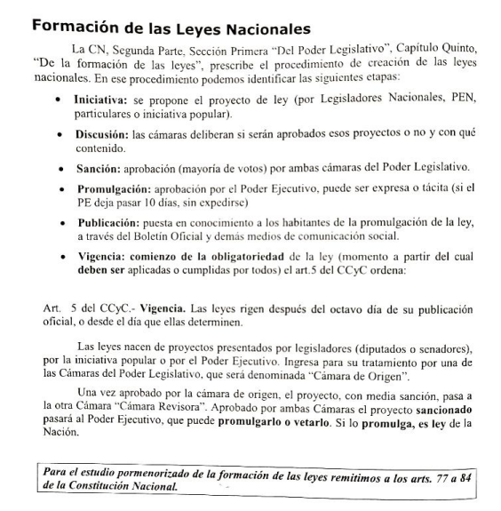

# Constitución Nacional

## Estructura
- Preambulo
- Primera PArte
  - Declaraciones, derechos, garantías
  - Nuevos derechos y garantías
- Segunda parte: Autoridades de la Nación
  - Gobierno federal
  - Gobiernos de provincia
- Disposiciones trnasitorias

> [!NOTE] Preámbulo
> Nos los representantes del pueblo de la Nación Argentina, reunidos en Congreso General Constituyente por voluntad y elección de las provincias que la componen, en cumplimiento de pactos preexistentes, con el objeto de constituir la unión nacional, afianzar la justicia, consolidar la paz interior, proveer a la defensa común, promover el bienestar general, y asegurar los beneficios de la libertad, para nosotros, para nuestra posteridad, y para todos los hombres del mundo que quieran habitar en el suelo argentino: invocando la protección de Dios, fuente de toda razón y justicia: ordenamos, decretamos y establecemos esta Constitución, para la Nación Argentina.

Convención constituyente: Unico organo (especial para esto): habilitado para reformar la constitución.

## Modificaciones
Hubo 6 modificaciones en total.
3 en el sigo XIX y 3 en el siglo XX

## Primera Parte

### Declaraciones
Expresiones, manifestaciones o afirmaciones en las que se toma posición acerca de cuestiones fundamentales, como la forma de gobierno o la organización de las provincias.

#### Artículo 1ro
> [!NOTE] Artículo 1ro
> “La Nación Argentina adopta para su gobierno la forma REPRESENTATIVA, REPUBLICANA y FEDERAL”.

- Forma **representativa**/ forma democrática indirecta: El poder político procede del pueblo pero no es ejercido por él sino por sus representantes elegidos por medio del sufragio.
- Forma **republicana** de gobierno:
  - Soberanía popular (El pueblo gobierna a través de sus representantes)
  - División de poderes (PE, PL, PJ: Controles recíprocos)
  - Periodicidad de mandatos (Evaluación, control, recambio)
  - Responsabilidad de los funcionarios (Controles: Juicio político, control oposición, control del pueblo- voto )
  - Igualdad ante la ley (Control recíproco Estado- habitantes - [Art. 16](https://servicios.infoleg.gob.ar/infolegInternet/anexos/0-4999/804/norma.htm#:~:text=de%20la%20Rep%C3%BAblica.-,Art%C3%ADculo%2016,-.%2D%20La%20Naci%C3%B3n%20Argentina))
  - CN (Necesaria, Supremacía Constitucional)
- Forma **Federal** de organización del Estado:
  - Estado Nacional soberano
  - Provincias autónomas

### Derechos 
Facultades que la Constitución reconoce a los habitantes del país para que puedan vivir con dignidad. Al estar así reconocidas, los habitantes pueden exigir su respeto.

- Derechos civiles: Libre tránsito
- Derechos políticos: Sufragio 
- Derechos sociales: 14bis

### Garantías
Protecciones, establecidas en la Constitución para asegurar el respeto de los derechos y las libertades que ella reconoce.

#### Nuevos Derechos y Garantías
Sobre temas que la sociedad argentina fue considerando esenciales en los últimos años.

##### El amparo  [Art. 43 CN](https://servicios.infoleg.gob.ar/infolegInternet/anexos/0-4999/804/norma.htm#:~:text=organismos%20de%20control.-,Art%C3%ADculo%2043,-.%2D%20Toda%20persona)

Destacamos su estudio dentro de los Nuevos derechos y garantías de la Constitución Nacional

- Es una **garantía**
- Derechos sin otra forma de ser reclamados
- ACCIÓN urgente
- Contra acto u omisión
- Autoridades públicas – particulares
- Lesionar- alterar – amenazar los Derechos, garantías CN, Tratado o Ley
- Legitimados: Afectado, defensor, asociaciones, familia, etc.

- Habeas data (protección de los datos)
- Habeas corpus (libertad física)

> TO-DO: Cuando puedo interponerlo? Tipos de habeas data, habeas corpus

## Segunda Parte
Nuevos organismos agregados en el 42

Municipalidades
- Autonomía municipal 
- Ordenanzas
- Concejos Deliberantes

Auditoría General de la Nación
- Asistencia del Congreso
- Control Administración pública
- Dictamen

Defensoría del pueblo
- Autonomía funcional
- Legitimación procesal por derechos y garantías CN y otras leyes

Jefe de gabinete de ministros
- Refrendar y legalizar actos del Presidente
- Informar marcha del gobierno

Consejo de la Magistratura
- Selección de los magistrados
- Administración del Poder Judicial

Ministerio Público
- Autonomía funcional
- Promover actuación de la justicia
1. Ministerio Público Fiscal (Fiscales)
2. Ministerio Público de la Defensa (Defensores públicos)

## Proceso de formación de las leyes nacionales
el PE (o cualquier ciudadano con aval) puede presentar un proyecto de ley
La ley pasa por dos cáamras: origen y revisora.

Que poderes intervienen: 
- Poder Legislativo (Discute, sanciona)
- Poder Ejecutivo (Promulga o veta la ley)
