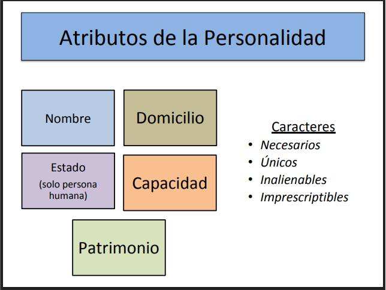
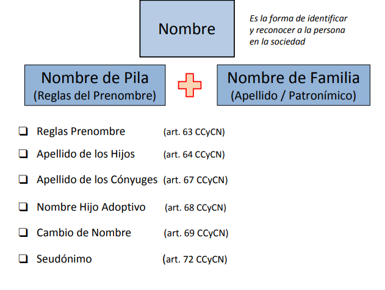
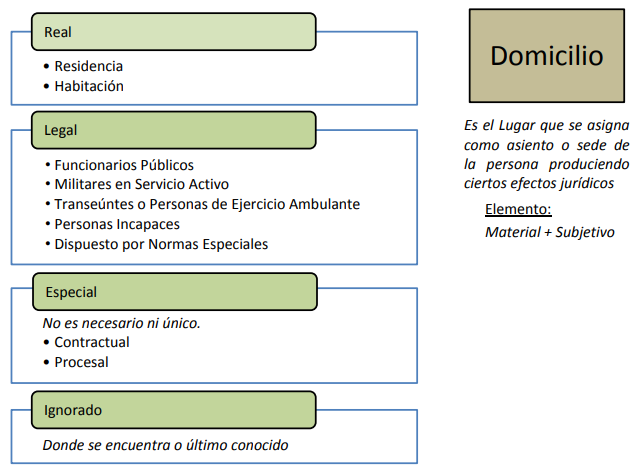

# Persona

La persona es el sujeto del derecho.

Es quien puede ser titular de derechos, ejercerlos y contraer obligaciones.

Clases de Personas:
- Humana
- Jurídica

Las personas Jurídicas se dividen en Públicas y Privadas.

## Etapas de la persona
- Concepción
- Perona por nacer
- Nacimiento
- Niñez (hasta los 13)
- Adolescencia (hasta los 18)
- Adulto (+18)
- Muerte

> [!NOTE] 
> El codigo civil define a la *Persona por nacer* como una persona. Sin embargo, si este nace muerto, se toma como si esa persona nunca hubiese existido legalmente.
>
> Ejemplo: Si un abuelo le da una donación a su nieto por nacer. Pero si este no nace, ese acuerdo se invalida.

## Atributos de la Persona

https://aulasvirtuales.frba.utn.edu.ar/pluginfile.php/889571/mod_resource/content/1/U.T.N.%20PERSONA%204%20Dfntv.pdf