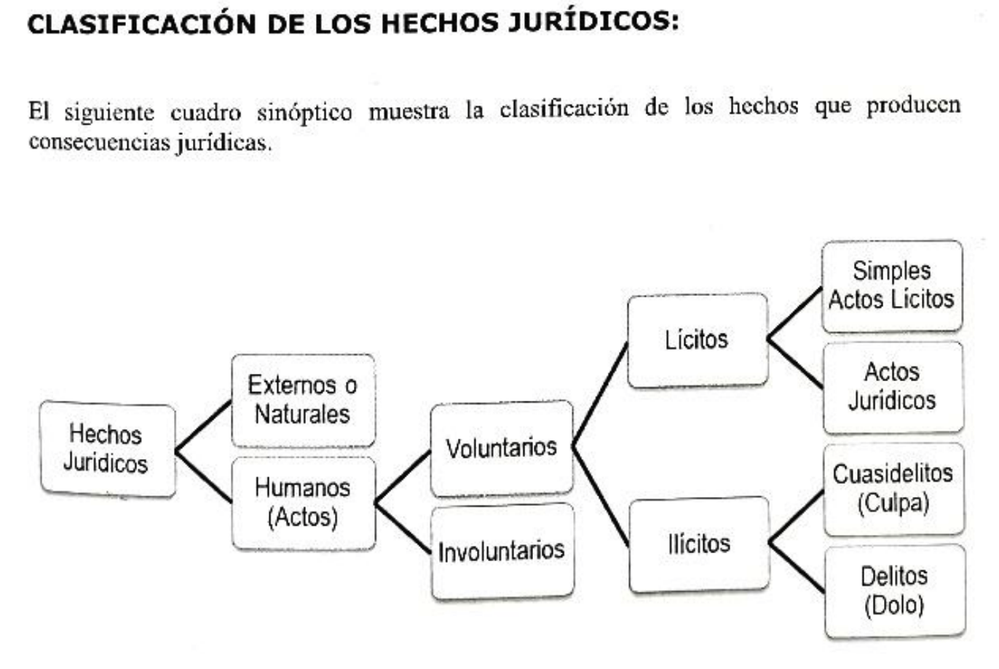

# Unidad 5: Hechos y Actos Jurídicos

Para que un acto sea volunario, requiere como elemento interno:
1) Discernimiento
2) Intención
3) Libertad
Y debe ser exteriorizado.

Cada elemento puede tener vicios, que invalide la volunatriedad del hecho.
1) Discernimiento:
    - Edad
    - Sustancia
2) Intención
    - Ignorancia o error
    - Dolo: un tercero te miente
3) Libertad
    - Fuerza irresistible
    - Amenaza

> [!TIP] Cuasidelito
> Un ilícito cometido sin intención. Culpa.
> Negligencia, impericia

> [!TIP] Delito
> Se comete adrede. Dolo.

Acto juridico: inmediata la consecuencia. Lo hago para que suceda.

Simple acto: Es algo que puede eventualmente traer una consecuencia juridica. (Manejar. Puede llegar a traer un accidente).

## Elementos
- Sujetos
- Objeto
- Causa
- Forma

Acto lícito e inmediato que busca adqusicion, extincion, modificacion de algun derecho.

Acto juridico: se forma un compromiso legal

Los Sujetos pueden ser Activo (acreedor) y Pasivo (deudor) y puede haber un Tercero (ajeno)

El objeto es el bien hecho o material sobre el cual cae el interes de ambas partes. Tiene que ser posible, no puede ir en contra de la fe y las buenas costumbres, no puede vulnerar derechos, no puede estar prohibida la comercializacion. Art 279

Arts 280 (convalidación): si esta sujeto a un plazo en el cual en algun momento sea posible a futuro, entonces se convalida.
Por ejemplo, al firmar un contrato, ese objeto aun no existe, pero eventualmente puede existir.

La causa fuente es la que da origen, por ejemplo el acuerdo entre inquilino y propietario.

LA causa fin es el fin. El inquilino quiere vivir ahi y el dueño cobra.

Licitos, invlucrados de manera expresa, se involucran los deseos de las partes.

Forma: Formal e informal.

### Instrumentación
Publico o privado.

PUBLICO
- Presencia: Tiene que estar
- Competencia: Tiene que poder
- Capacidad: autorizado legal
- Observancai de las formalidades

El instrumento publico es exsitente, verdadero, fecha cierta y sus firmas estan validadas y no es necesario que un caligrafo certifique que la firma sea esa.

- Positivo: suma derechos
- Negativo: me tengo que abstener de algo
Unilateral o bilateral

- Entre vivos: La persona no debe fallecer para que se cumpla.
- Ultima voluntad: Apenas fallece la persona. Testamento

- Tienen contenido economico apreciable en dinero: alquiler, compraventa
- No patrimonial: no tienen obligaciones suceptibles a ser comprables con plate: Adopcion, hijos