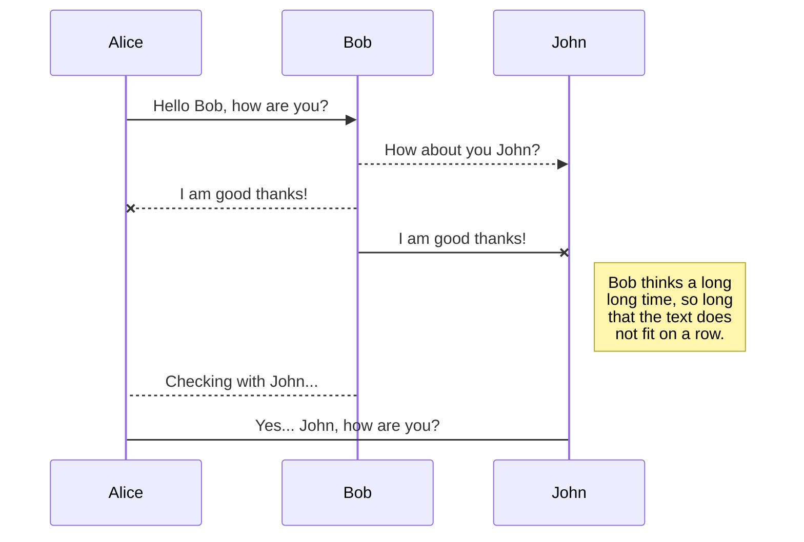
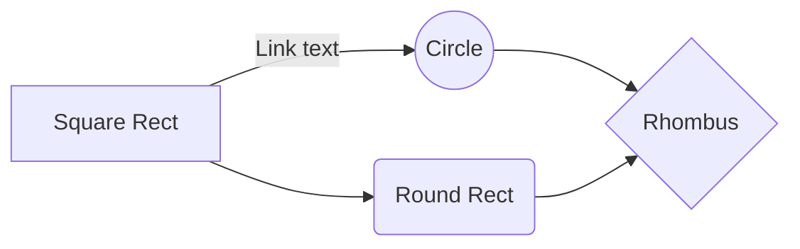
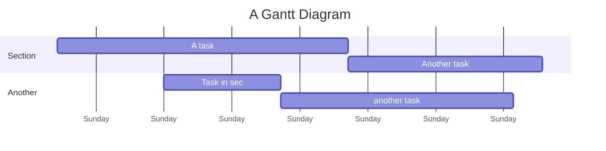

# Welcome to edtrmd!

Hi! I'm your first Markdown file in **edtrmd**. If you want to learn about edtrmd, you can read me. If you want to play with Markdown, you can edit me. Once you have finished with me, you can create new files by opening the **file explorer** on the left corner of the navigation bar.

# Files

```haskell
test :: Number -> Number
test hola = hola * 2
```


edtrmd stores your files in your browser, which means all your files are automatically saved locally and are accessible **offline!**

## Create files and folders

The file explorer is accessible using the button in the left corner of the navigation bar. You can create a new file by clicking the **New file** button in the file explorer. You can also create folders by clicking the **New folder** button.

## Switch to another file

All your files and folders are presented as a tree in the file explorer. You can switch from one to another by clicking a file in the tree.

## Rename a file

You can rename the current file by clicking the **Rename** button in the file explorer context menu.

## Delete a file

You can delete the current file by clicking the **Delete** button in the file explorer context menu.

## Export a file

You can export the current file by clicking the download button in the toolbar. You can export as plain Markdown or as a standalone HTML file. You can also **Print / Save as PDF** directly from the toolbar.

# Markdown extensions

edtrmd extends the standard Markdown syntax by adding extra features.

## KaTeX


You can render LaTeX mathematical expressions using [KaTeX](https://khan.github.io/KaTeX/):

The *Gamma function* satisfying $\Gamma(n) = (n-1)!\quad\forall n\in\mathbb N$ is via the Euler integral

$$
\Gamma(z) = \int_0^\infty t^{z-1}e^{-t}dt\,.
$$

> You can find more information about **LaTeX** mathematical expressions [here](http://meta.math.stackexchange.com/questions/5020/mathjax-basic-tutorial-and-quick-reference).

## UML diagrams

You can render UML diagrams using [Mermaid](https://mermaidjs.github.io/). For example, this will produce a sequence diagram:



And this will produce a flow chart:



## Mermaid bar grpah
```mermaid
bar
    title Sales per month
    "January" : 42
    "February" : 58
    "March" : 75
    "April" : 63
    "May" : 89
    "June" : 97
```

## Vega-Lite charts

You can render interactive data visualizations using [Vega-Lite](https://vega.github.io/vega-lite/) with a JSON spec inside a fenced code block:



## Music scores

You can render ABC notation music scores:

```abc
X:1
T:Twinkle Twinkle
M:4/4
L:1/4
K:C
|CCGG|AAG2|FFEE|DDC2|
```

## Callouts

You can add GitHub-style alert callouts using blockquote syntax:

> [!NOTE]
> Useful information that users should take into account.

> [!TIP]
> Helpful advice for doing things better or more easily.

> [!IMPORTANT]
> Key information users need to know to achieve their goal.

> [!WARNING]
> Urgent info that needs immediate user attention to avoid problems.

> [!CAUTION]
> Negative potential consequences of an action.

## Subscript & Superscript

Use `~` for subscript and `^` for superscript:

- H~2~O (water)
- CO~2~ (carbon dioxide)
- x^2^ + y^2^ = r^2^
- 10^3^ = 1000

## Footnotes

Add footnotes with `[^label]` inline and define them anywhere[^1]:

Footnotes can also use named labels for clarity[^note].

[^1]: This is the first footnote definition.
[^note]: Named footnotes work just as well.

## Image sizing

Control image dimensions with `=WxH` at the end of the alt/URL:

```


```

- `=200x100` — sets width 200px, height 100px
- `=400x` — sets width 400px, auto height

## Highlight

You can ==highlight text== using double equals signs.

## Task lists

- [x] Write the welcome document
- [x] Add KaTeX support
- [x] Add Mermaid diagrams
- [ ] Take over the world

## Tables

|                |Syntax                         |Output                       |
|----------------|-------------------------------|-----------------------------|
|Bold            |`**bold**`                    |**bold**                     |
|Italic          |`*italic*`                   |*italic*                     |
|Highlight       |`==text==`                   |==highlighted==              |
|Inline code     |`\`code\``               |`code`                     |

## Heading alignment

You can align headings using class modifiers:


## Page breaks

Use `::pb::` on its own line to insert a page break when printing or exporting to PDF.
