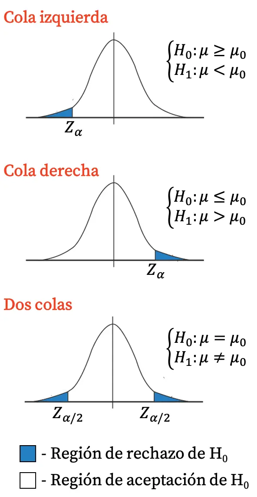

# Test de hipotesis

Hipotesis: Es una observacion acerca de un parametro

$H_0$ : Hipotesis nula

$H_1$ : Hipotesis alternativa

$$ 
H_0 \quad \theta = \theta_0 \begin{cases}
H_1: \theta \neq \theta_0 & \text{(bilateral)} \\
H_1: \theta > \theta_0 & \text{(unilateral derecha)} \\
H_1: \theta < \theta_0 & \text{(unilateral izquierda)} \\
\end{cases}
$$

La hipotesis de lo que se quiere probar es la hipotesis nula, y la hipotesis de lo que se quiere demostrar es la hipotesis alternativa.
||Acepto $H_0$| Rechazo $H_0$|
|------|----------|----------------|
| $H_0$ es V|Correcto| Error de tipo I|
| $H_0$ es F| Error de tipo II|Correcto|

- Probabilidad de cometer un error de tipo 1: $\alpha$
- Probabilidad de cometer un error de tipo 2: $\beta$

- $\alpha$ es el nivel de significación = $P(\text{Cometer error tipo I})$
- $\beta = P(\text{Cometer error tipo II})$

$\alpha$ y $\beta$ son probabilidades condicionales pues:
- $\alpha = P(\text{Rechazar } H_0 | H_0 \text{ es verdadera})$
- $\beta = P(\text{Aceptar } H_0 | H_0 \text{ es falsa})$

## Test de Hipotesis para la media $\mu$ poblacional. Poblacion normal.$\sigma$ conocido

Es un test exacto.

Los pasos para realizar un test de hipotesis son:

1) $H_0: \mu = \mu_0$

Elijo un caso
- $H_1: \mu > \mu_0$ (Caso 1)
- $H_1: \mu < \mu_0$ (Caso 2)
-  $H_1: \mu \neq \mu_0$ (Caso 3) 
2) Elijo un nivel de significación $\alpha$.

Trato de que sea lo mas pequeño posible, pero no tan pequeño que el test pierda poder. (1% - 10%)

3) Se plantea la regla de decisión.

- Para el caso 1, se rechaza $H_0$ si $\frac{\bar{X} - \mu_0}{\sigma/\sqrt{n}} > Z_{\alpha}$
- Para el caso 2, se rechaza $H_0$ si $\frac{\bar{X} - \mu_0}{\sigma/\sqrt{n}} < -Z_{1 - \alpha}$ 
- Para el caso 3, se rechaza $H_0$ si $\frac{\bar{X} - \mu_0}{\sigma/\sqrt{n}} < -Z_{\alpha/2}$ o $\frac{\bar{X} - \mu_0}{\sigma/\sqrt{n}} > Z_{\alpha/2}$

> [!NOTE] 
> El area de la zona de rechazo es $\alpha$ para el caso 1 y 2, y $2\alpha$ para el caso 3. Por eso se dice que el test bilateral es mas exigente que el unilateral, pues tiene una zona de rechazo mas grande.

4) Se busca Z observado

$$ Z_{obs} = \frac{\overline{X_m} - \mu_0}{\sigma/\sqrt{n}} $$

$\overline{X_m}$ es la media muestral obtenida a partir de los datos muestrales.

Comparo el valor de $Z_{obs}$ con el valor crítico y tomo la decisión.

5) Se concluye

Se acepta o se rechaza $H_0$ y se interpreta el resultado en el contexto del problema.

## Test de hipotesis para la media $\mu$ poblacional. Poblacion normal.$\sigma$ desconocido

Se usa S en lugar de $\sigma$ pues no se conoce la desviación estándar poblacional.

Se usa la distribución t de Student con $n-1$ grados de libertad en lugar de la distribución normal estándar.

Hipotesis: $H_0: \mu = \mu_0$

1) Elijo un caso
- $H_1: \mu > \mu_0$ (Caso 1)
- $H_1: \mu < \mu_0$ (Caso 2)
- $H_1: \mu \neq \mu_0$ (Caso 3)

1) Fijo un nivel de significación $\alpha$.

Se rechaza $H_0$ si:
- Para el caso 1, se rechaza $H_0$ si $\frac{\bar{X} - \mu_0}{S/\sqrt{n}} > t_{n-1, 1 - \alpha}$
- Para el caso 2, se rechaza $H_0$ si $\frac{\bar{X} - \mu_0}{S/\sqrt{n}} < -t_{n-1, 1 - \alpha}$ 
- Para el caso 3, se rechaza $H_0$ si $\frac{\bar{X} - \mu_0}{S/\sqrt{n}} < -t_{n-1, 1 - \alpha/2}$ o $\frac{\bar{X} - \mu_0}{S/\sqrt{n}} > t_{n-1, 1 - \alpha/2}$

> [!TIP] Ejercicio
> A partir de los datos: $H_0: \mu = 20$, $H_1: \mu < 20$, $\alpha = 0.05$, $n = 16$, $\bar{X} = 17.25$, $S = 4.3$
>
> Se rechaza $H_0$ si $\frac{17.25 - 20}{4.3/\sqrt{16}} < -t_{15, 0.95}$
>
> Calculamos el valor crítico: $t_{15, 0.95} = 1.753$
>
> Calculamos el valor observado: $\frac{17.25 - 20}{4.3/\sqrt{16}} = -2.55$
>
> Como $-2.55 < -1.753$, se rechaza $H_0$.
>
> A un nivel de significación del 5%, se concluye que la media poblacional es menor a 20.

## Test de hipotesis para la varianza $\sigma^2$ poblacional. Poblacion normal.

$H_0: \sigma^2 = \sigma_0^2$

1) Elijo un caso
- $H_1: \sigma^2 > \sigma_0^2$ (Caso 1)
- $H_1: \sigma^2 < \sigma_0^2$ (Caso 2)
- $H_1: \sigma^2 \neq \sigma_0^2$ (Caso 3)

2) Fijo un nivel de significación $\alpha$.

- Para el caso 1, se rechaza $H_0$ si $\frac{(n-1)S^2}{\sigma_0^2} > \chi^2_{n-1, 1 - \alpha}$
- Para el caso 2, se rechaza $H_0$ si $\frac{(n-1)S^2}{\sigma_0^2} < \chi^2_{n-1, \alpha}$
- Para el caso 3, se rechaza $H_0$ si $\frac{(n-1)S^2}{\sigma_0^2} < \chi^2_{n-1, \alpha/2}$ o $\frac{(n-1)S^2}{\sigma_0^2} > \chi^2_{n-1, 1 - \alpha/2}$              

## Test de hipotesis para la proporcion $p$ poblacional (Asintotico)

No es exacto, pero es una buena aproximación cuando el tamaño de la muestra es grande.
                                                                                                      

$H_0: p = p_0$

1) Elijo un caso

- $H_1: p > p_0$ (Caso 1)
- $H_1: p < p_0$ (Caso 2)
- $H_1: p \neq p_0$ (Caso 3)

2) Fijo un nivel de significación $\alpha$.

- Para el caso 1, se rechaza $H_0$ si $\frac{\hat{p} - p_0}{\sqrt{\frac{p_0 \cdot q_0}{n}}} > Z_{1- \alpha}$
- Para el caso 2, se rechaza $H_0$ si $\frac{\hat{p} - p_0}{\sqrt{\frac{p_0 \cdot q_0}{n}}} < -Z_{1 - \alpha}$ 
- Para el caso 3, se rechaza $H_0$ si $\frac{\hat{p} - p_0}{\sqrt{\frac{p_0 \cdot q_0}{n}}} < -Z_{1- \alpha/2}$ o $\frac{\hat{p} - p_0}{\sqrt{\frac{p_0 \cdot q_0}{n}}} > Z_{1 - \alpha/2}$

- $q_0 = 1 - p_0$

3) Se busca el valor observado

$$ Z_{obs} = \frac{\hat{p} - p_0}{\sqrt{\frac{p_0 \cdot q_0}{n}}} $$

### P-valor

El p-valor es el menor nivel de significación $\alpha$ para el cual se rechaza $H_0$.

Si el p-valor es menor que el nivel de significación elegido, se rechaza $H_0$.

